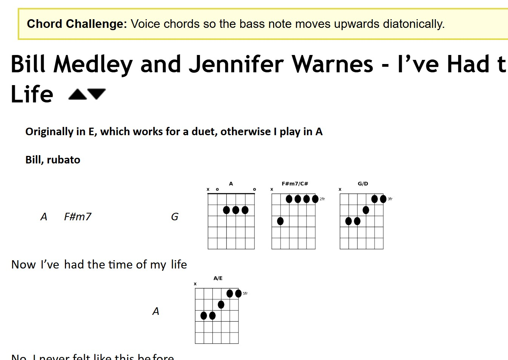
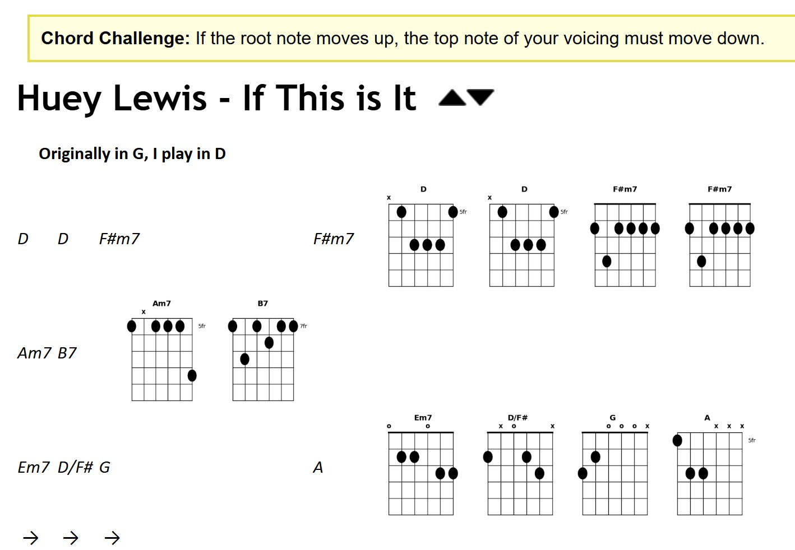
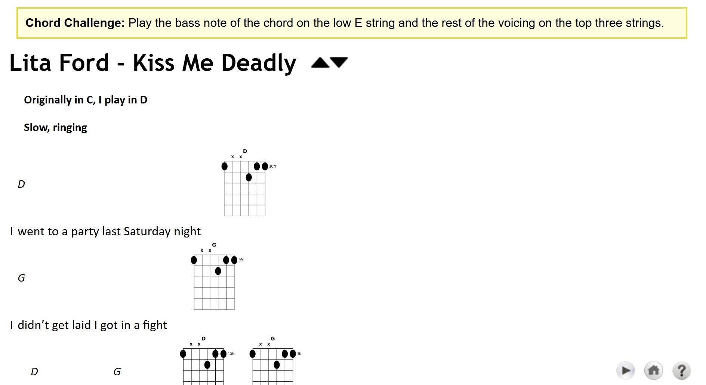
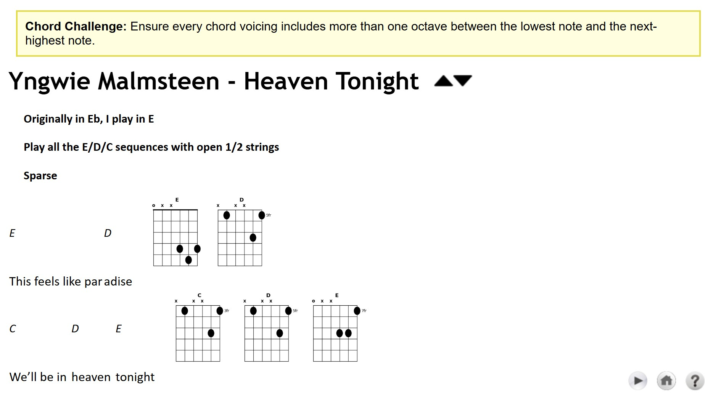

# Chord Voicing Challenge App

This application is a practice tool for guitarists. It wraps an existing local HTML songbook and dynamically injects "chord voicing challenges" into the songs, e.g.:

* Voice chords so the top note moves upwards in diatonic steps for an entire phrase.
* Use inversions to keep the bass note on the 5th string for the entire song.
* Alternate between a closed triad voicing and an extended voicing every other bar.
* Play all chords as slash chords where the bass note is the 3rd of the chord.

Challenges were generated by AI, but are stored in a static file that is human-editable.

## Overview

When you view a song, the app:
1.  Selects a random challenge from `challenges.txt` (e.g., "Play all chords as triads", "Drop 2 voicings").
2.  Uses **Google Gemini 3.0 Pro** (`gemini-3-pro-preview`) to generate specific chord voicings that satisfy the challenge for that specific song's chord progression.
3.  Dynamically generates guitar chord diagrams using Python (`matplotlib`).
4.  Injects these diagrams into the song's HTML, displaying them alongside the lyrics.

## Project structure

*   **`app.py`**: The Flask web server. Intercepts requests for song files, processes them, and serves the modified HTML.
*   **`gemini_client.py`**: Handles communication with the Google GenAI API to get voicing data (JSON format).
*   **`chord_generator.py`**: Generates PNG images of chord diagrams from the voicing data using Matplotlib (Agg backend).
*   **`song_processor.py`**: Parses the original HTML using BeautifulSoup and injects the generated chord images into the table structure.
*   **`generate_challenges.py`**: A one-time script used to populate `challenges.txt` with creative challenges using AI.
*   **`challenges.txt`**: A text file containing the list of challenges (editable).
*   **`run.bat`**: Simple batch file to start the server.

## Requirements

*   Python 3.12+
*   Dependencies listed in `requirements.txt` (`flask`, `matplotlib`, `google-genai`, `beautifulsoup4`, `requests`).
*   A Google Gemini API key located at `g:\temp\gemini_key.txt`.
*   Songbook source files located at `C:\git\songbook\output\dan_songbook\dan_songbook_split`.

## Setup & usage

1.  **Install dependencies:**
    ```bash
    pip install -r requirements.txt
    ```

2.  **Run the application:**
    Double-click `run.bat` or run:
    ```bash
    python app.py
    ```

3.  **Access in browser:**
    Go to [http://127.0.0.1:5000/](http://127.0.0.1:5000/)

## Notes

*   The application uses `matplotlib.use('Agg')` to ensure thread-safety when generating images in a web server environment.
*   The server attempts to use the `gemini-3-pro-preview` model. Ensure your API key has access to this model.
*   If the API call fails (or the key is missing), the song page will load without the injected voicings.

## Examples

In each of these examples, the lyrics, chords, and performance notes were already there; this app uses AI to add the "chord challenge" and the suggested chord voicings to satisfy that challenge.

<br/><hr>
<br/><hr>
<br/><hr>
<br/><hr>
<br/><hr>
